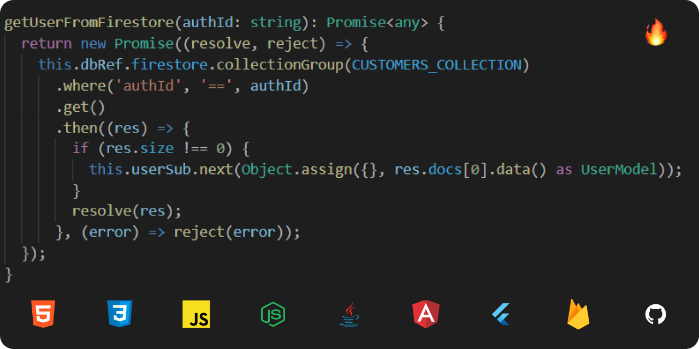

```HTML 
<Developers>Hello Everyone! Welcome to My World and Thank You Visiting</Developers> 
```
<!--  -->

### About Me

🔥 &nbsp;I am Gurlivleen Singh Kainth and a Full-Stack Developer.  
👨‍🎓 &nbsp;Studing at Guru Nanak Dev Engineering College, Ludhiana as a student of Bachlor of Technology in Information Technology.  
💼 &nbsp;I have gained the experience under my mentor **[Ishant Kumar](https://github.com/ishantk "Er. Ishant Kumar")** in technologies like **Angular**, **Java**, **NodeJS**, and **Firebase**.  
💼 &nbsp;Worked on real-time projects which are based on **Angular** and **Firebase**.

<!--  -->

### My Acquire Skills

Name | Description 
:-----------:|:------------
[](https://angular.io/docs)  Angular | Angular is a TypeScript-based free and open-source web application framework led by the Angular Team at Google and by a community of individuals and corporations. Angular is a complete rewrite from the same team that built AngularJS. Angular is used as the frontend of the MEAN stack, consisting of MongoDB database, Express.js web application server framework, Angular itself (or AngularJS), and Node.js server runtime environment.
[](https://flutter.dev/docs) Flutter | Flutter is an open-source UI software development kit created by Google. It is used to develop cross platform applications for Android, iOS, Linux, Mac, Windows, Google Fuchsia, and the web from a single codebase.
[](https://firebase.google.com/docs) Firebase | Firebase is a platform developed by Google for creating mobile and web applications. It was originally an independent company founded in 2011. In 2014, Google acquired the platform[1] and it is now their flagship offering for app development.

### Connect With Me

[](https://www.linkedin.com/in/gurlivleen2000/) &nbsp; [](https://twitter.com/gurlivleen2000) &nbsp; [](mailto:gurlivleen.kainth2000@gmail.com) &nbsp; [](https://www.instagram.com/gurlivleen2000/)
